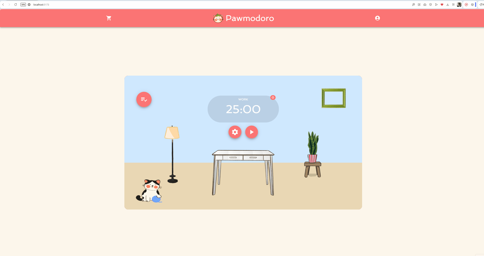
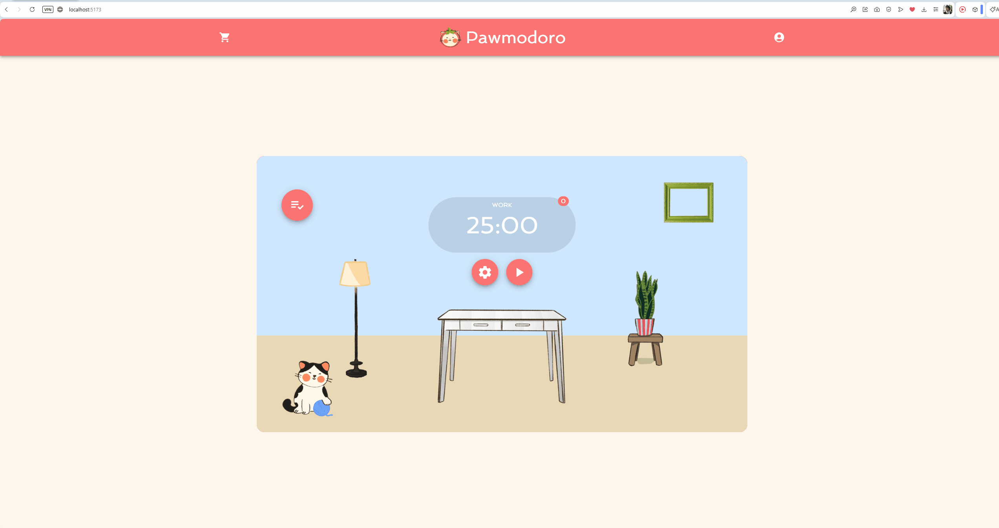
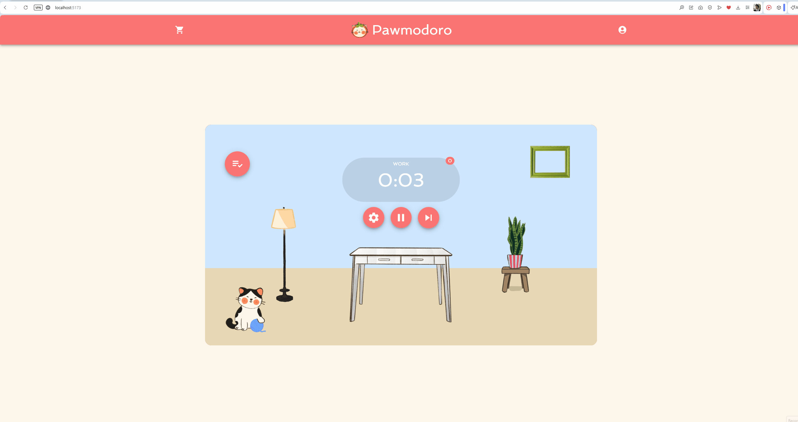
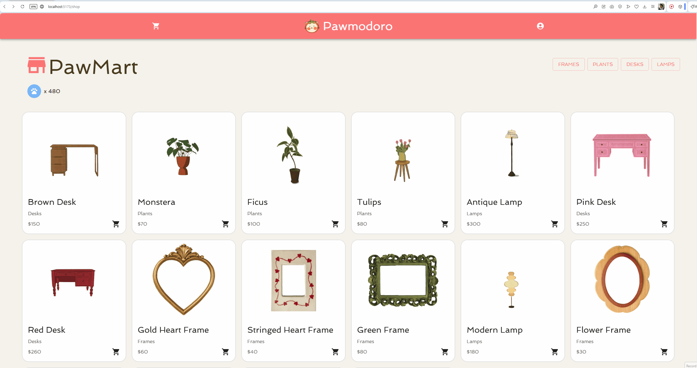
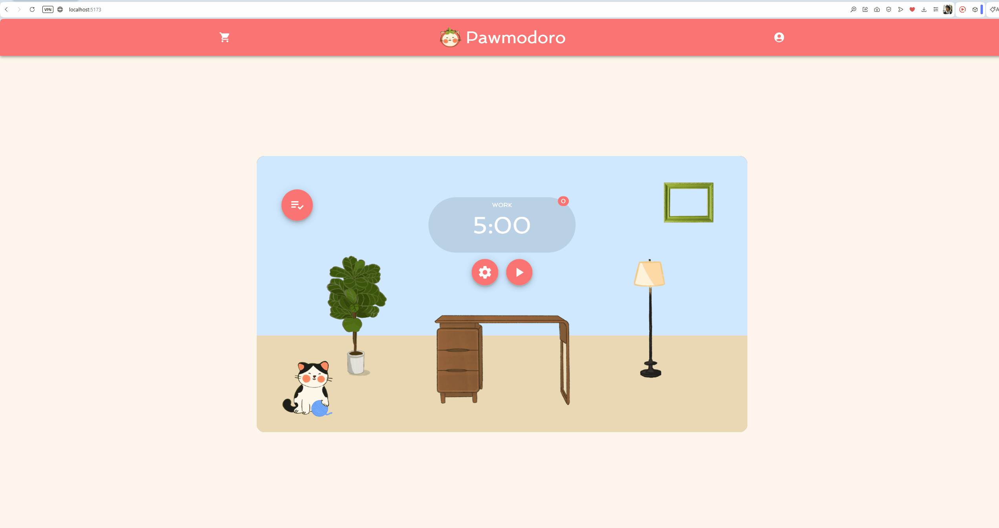

# PAWmodoro :3

CodePath WEB103 Final Project

Designed and developed by: Grecia Osorio, Brandon Budhan, Divya Ganesh, Lan Doam

🔗 Link to deployed app: https://client-dydj.onrender.com/

## About
Pawmodoro is a gamified study timer experience utilizing the Pomodoro technique!

### Description and Purpose

In Pawmodoro, the player has a loyal, energetic pet. During study sessions, their pet will play, and during breaks, they come back with rewards! The player can use these rewards and resources to obtain items, allowing them to obtain more items, decorations, and upgrade their pet's energy. 

Pawmodoro is built to gamify the Pomodoro Technique, creating a satisfying balance of productivity and entertainment. Users have one more thing to look forward to during their breaks, and allows them to romanticize the work they do!

### Inspiration

Pawmodoro was inspired by the desire to have a more entertaining studying/working experience. Finding joy and aesthetic pleasure in work results in increased productivity, and a more fulfilling experience. By gamifying productivity, players will look forward to the ways Pawmodoro rewards them for working hard (and taking breaks)!

## Tech Stack

Frontend: React, Material UI

Backend: Express, PostgreSQL, Firebase Authentication

## Features

### ✅ Flexible Focus Timer

Stay in the zone with a timer that adapts to your workflow. Finish a task early? Seamlessly swap to your next to-do item mid-session without losing your momentum or having to restart the clock.

### ✅ Custom Timer Profiles

Work your way by setting up custom work and break intervals. Whether you want a quick 15-minute sprint or a 50-minute deep dive, you're in control—and the longer you choose to focus, the bigger your coin reward will be!

### ✅ Earn Coins While You Work

Turn your productivity into playtime! Get instant rewards just for checking off quick tasks, and earn PawCoins during your focus sessions.

### ✅ Daily Task Tracker

Keep your goals organized in one place. Easily add, update, and check off your daily to-dos so you always know exactly what you need to tackle next.

### ✅ The Paw-Mart Shop

Treat yourself (and your pet) with some stylish new furniture and accessories using your PawCoins! 

### ✅ Customize Your Virtual Room

Create the perfect cozy space for your virtual pet. Mix and match the items you've purchased to decorate the room, instantly seeing your new design come to life in your virtual room.

## Installation Instructions

1. Clone the repository
2. Run `npm install` in both the `client` and `server` directories
3. In `server/`, run `npm run start`
4. In `client/`, run `npm run dev`
